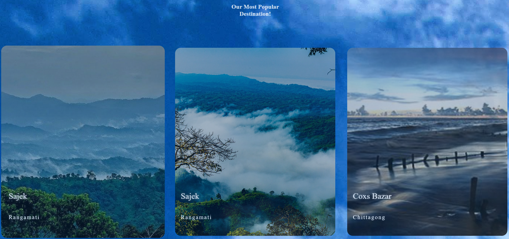

# Toursim_Bangladesh

This repository hosts the source code and assets for a **Tourism Website**, which highlights the rich cultural and natural attractions of Bangladesh. The website is designed to inspire and assist tourists in exploring the country's beautiful destinations.

## Features

- **Homepage**: Welcoming landing page with an overview of the website.
- **Destination Page**: Detailed insights into popular tourist destinations like Dhaka, Chittagong, Sylhet, Sajek, Sundarbans, and Cox's Bazar.
- **Packages Page**: Information on travel packages for visitors.
- **About Page**: Background information about the website or organization.
- **Responsive Design**: Optimized for various devices, ensuring accessibility.

## File Structure

- `Index.html`: The main landing page.
- `Destination.html`: Page showcasing different destinations.
- `Package.html`: Page with travel packages.
- `About.html`: About us page.
- `Style.css`: Styling for the entire website.
- Image Files: High-quality visuals for each destination.

## How to Run Locally

1. Clone the repository:
   ```bash
   https://github.com/Rezwan45/Toursim_Bangladesh.git
   ```

2. Navigate to the project directory:
   ```bash
   cd tourism-website
   ```

3. Open `Index.html` in your browser to view the website.

## Technologies Used

- **HTML5**: For structuring content.
- **CSS3**: For styling and layout.

## Screenshots

### Homepage


### Destination Page


### Packages Page


## License

This project is licensed under the MIT License. See the `LICENSE` file for details.

---

Feel free to fork and customize this repository to create your own tourism website or to explore the beautiful destinations of Bangladesh!
